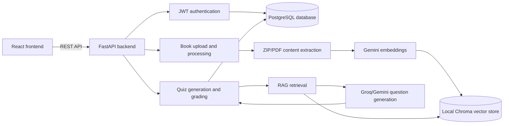

# CogniGen Backend

FastAPI backend for CogniGen, an adaptive RAG-based cognitive assessment platform. The backend handles authentication, document ingestion, book processing, retrieval, question generation, evaluation, and quiz workflows for the React frontend.

## Highlights

- Retrieval-augmented question generation from uploaded learning material.
- Multi-hop reasoning prompts for higher-order assessment questions.
- Evaluation module for answer quality and question validation.
- FastAPI service structure with schemas, models, auth, and database modules.
- Designed to pair with the `cognigen-frontend` React application.

## Tech Stack

- Python
- FastAPI
- SQLAlchemy
- RAG / LLM orchestration
- ChromaDB-style local retrieval store

## Architecture



CogniGen is organized as a REST API that keeps user, book, quiz, and response metadata in PostgreSQL while storing searchable learning chunks in a local vector store. Uploaded course material is extracted, chunked, embedded, and then retrieved during question generation so the assessment flow can cite source chapters and pages.

## Run Locally

```bash
pip install -r requirements.txt
copy .env.example .env
uvicorn app.main:app --reload
```

Update `.env` with your local PostgreSQL connection string and API keys before starting the server. Do not commit `.env`.

The API runs at `http://localhost:8000` by default, and the interactive FastAPI docs are available at `http://localhost:8000/docs`.

## Configuration

| Variable | Purpose |
| --- | --- |
| `DATABASE_URL` | PostgreSQL connection string used by SQLAlchemy. |
| `SECRET_KEY` | JWT signing secret for access tokens. |
| `GROQ_API_KEY` | LLM provider key for chat, generation, and grading flows. |
| `GEMINI_API_KEY` | Google Gemini key for embeddings and evaluation support. |

## Core API Surface

| Method | Endpoint | Purpose |
| --- | --- | --- |
| `POST` | `/api/v1/signup` | Register a teacher/user account. |
| `POST` | `/token` | Issue a JWT access token. |
| `POST` | `/api/v1/books/upload` | Upload zipped learning material for processing. |
| `GET` | `/api/v1/books` | List uploaded books for the authenticated user. |
| `POST` | `/api/v1/chat` | Ask questions across selected uploaded books. |
| `POST` | `/api/v1/generate-questions-from-book` | Generate assessment questions from retrieved source context. |
| `POST` | `/api/v1/quizzes` | Create a quiz from generated questions. |
| `GET` | `/api/v1/quizzes/{quiz_id}` | Open a quiz for student access. |
| `POST` | `/api/v1/quizzes/{quiz_id}/submit` | Submit student quiz answers. |
| `GET` | `/api/v1/quizzes/{quiz_id}/results` | View quiz responses and scores. |
