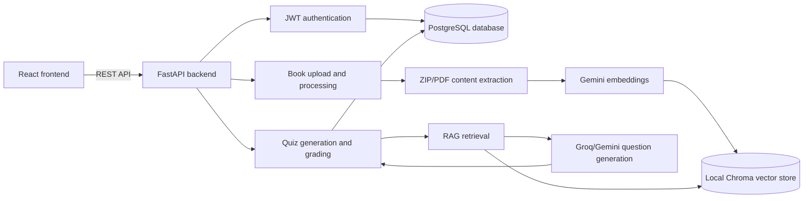

# CogniGen Backend

FastAPI backend for CogniGen, an adaptive RAG-based cognitive assessment platform. The backend handles authentication, document ingestion, book processing, retrieval, question generation, evaluation, and quiz workflows for the React frontend.

## Highlights

- Retrieval-augmented question generation from uploaded learning material.
- Multi-hop reasoning prompts for higher-order assessment questions.
- Evaluation module for answer quality and question validation.
- FastAPI service structure with schemas, models, auth, and database modules.
- Designed to pair with the `cognigen-frontend` React application.

## Tech Stack

- Python
- FastAPI
- SQLAlchemy
- RAG / LLM orchestration
- ChromaDB-style local retrieval store

## Architecture



CogniGen is organized as a REST API that keeps user, book, quiz, and response metadata in PostgreSQL while storing searchable learning chunks in a local vector store. Uploaded course material is extracted, chunked, embedded, and then retrieved during question generation so the assessment flow can cite source chapters and pages.

## Run Locally

```bash
pip install -r requirements.txt
uvicorn app.main:app --reload
```

Create a local `.env` file for secrets and API keys. Do not commit `.env`.
